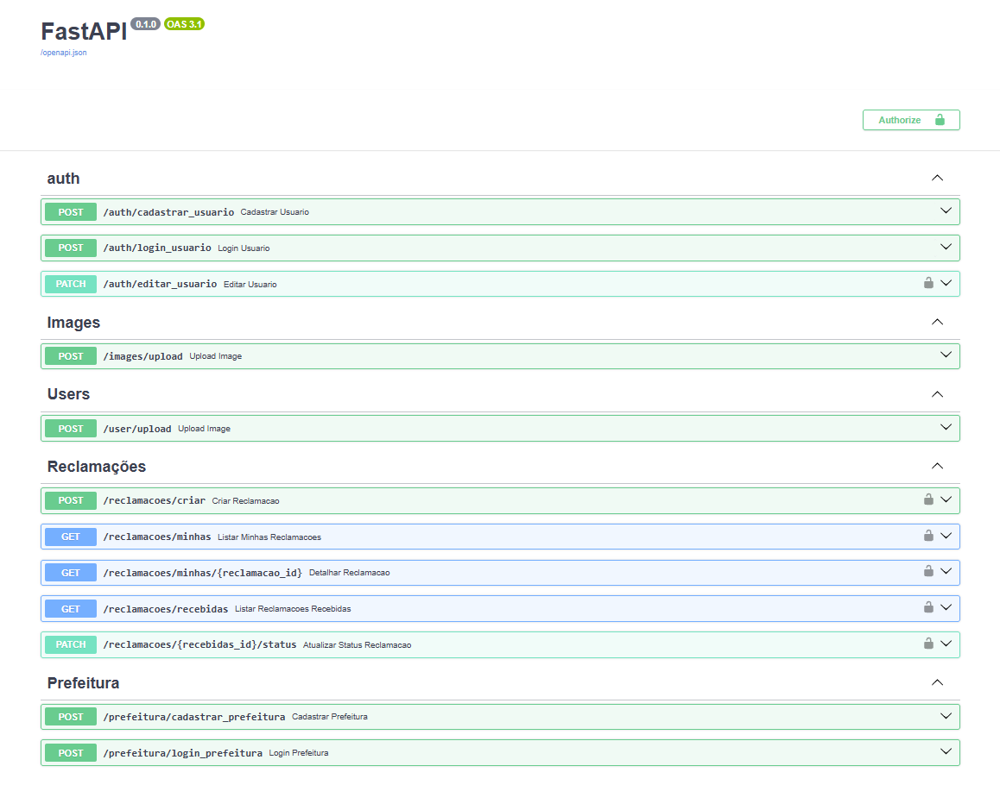

# ⚙️BACKEND-A3



## 🚀 Rodar Projeto
```
uvicorn main:app --reload
```
## 🌐 Testar
```
http://127.0.0.1:8000/docs
```


## 🟠 GIT
### 👨‍💻 Para adicionar seus arquivos:
```
git add .
git commit -m "suas alteracoes"
git push origin main
```

### Pegar as alteraçõs feitas por outros:
```
git pull origin main
```
